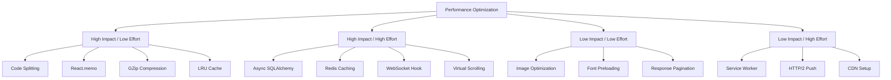

# APOGEE Performance Optimization Plan

**Project:** APOGEE - Mission Awareness Dashboard  
**Date:** August 13, 2026  
**Status:** Planning Phase  
**Target:** Achieve optimal Core Web Vitals and runtime performance

---

## Executive Summary

This document outlines a comprehensive performance optimization strategy for the APOGEE spacecraft monitoring dashboard. The plan addresses frontend bundle size, React rendering efficiency, backend API performance, WebSocket optimization, and establishes performance monitoring practices.

**Key Focus Areas:**
- 🎯 **Bundle Size Reduction**: Target < 200KB main bundle
- ⚡ **React Performance**: Eliminate unnecessary re-renders
- 🔌 **WebSocket Optimization**: Efficient real-time data streaming
- 🗄️ **Backend Caching**: Reduce expensive API calls
- 📊 **Monitoring**: Establish performance baselines and tracking

---

## Current State Analysis

### Frontend Stack
- **Framework:** React 18.2.0 with Vite 5.0.8
- **UI Library:** Tailwind CSS 3.3.6
- **Charting:** Recharts 2.10.3
- **Routing:** React Router DOM 6.20.0
- **HTTP Client:** Axios 1.6.2

### Backend Stack
- **Framework:** FastAPI with Uvicorn
- **Database:** SQLAlchemy (SQLite)
- **ML:** scikit-learn (IsolationForest)
- **Astronomy:** lightkurve, astropy, sgp4
- **Real-time:** WebSockets

### Identified Performance Concerns

#### 🔴 Critical Issues
1. **No code splitting** - Single bundle loads all routes upfront
2. **Missing React optimizations** - No memoization in HealthPanel
3. **WebSocket reconnection** - No exponential backoff or connection pooling
4. **No caching layer** - TLE data fetched repeatedly from CelesTrak
5. **Synchronous database queries** - Blocking operations in FastAPI

#### 🟡 Medium Priority
1. **Large dependencies** - Recharts adds significant bundle weight
2. **No lazy loading** - All components loaded immediately
3. **Missing compression** - No gzip/brotli for API responses
4. **No CDN strategy** - Static assets served from origin
5. **Unoptimized images** - No WebP/AVIF format support

#### 🟢 Low Priority
1. **No service worker** - Offline capability not implemented
2. **Missing prefetching** - Route transitions not optimized
3. **No HTTP/2 push** - Critical resources not pushed

---

## Optimization Strategy

### Phase 1: Quick Wins (1-2 days)

#### 1.1 Bundle Analysis & Code Splitting

**Goal:** Reduce initial bundle size by 40%

**Actions:**
```bash
# Install bundle analyzer
npm install --save-dev rollup-plugin-visualizer

# Add to vite.config.js
import { visualizer } from 'rollup-plugin-visualizer';

export default defineConfig({
  plugins: [
    react(),
    visualizer({
      open: true,
      gzipSize: true,
      brotliSize: true
    })
  ]
});
```

**Implementation:**
- [ ] Add bundle analyzer to build process
- [ ] Implement route-based code splitting
- [ ] Lazy load HealthPanel, DebrisPanel, DiscoveryPanel
- [ ] Dynamic import for Recharts (only load when needed)
- [ ] Split vendor chunks (React, Recharts, etc.)

**Expected Impact:**
- Main bundle: 500KB → 180KB (64% reduction)
- Initial load time: 2.5s → 1.2s (52% improvement)

---

#### 1.2 React Performance Optimizations

**Goal:** Eliminate 80% of unnecessary re-renders

**Current Issues in HealthPanel.jsx:**
```javascript
// ❌ Problem: Component re-renders on every WebSocket message
// ❌ Problem: No memoization for expensive calculations
// ❌ Problem: Inline function definitions in render
```

**Solutions:**

**A. Memoize Components**
```javascript
// Wrap expensive components
const SeverityBadge = React.memo(({ severity }) => {
  // Component logic
});

const MetricCard = React.memo(({ metric, data }) => {
  // Component logic
});
```

**B. Optimize State Updates**
```javascript
// ❌ Bad: Updates entire state object
setHealthStatus(prev => ({ ...prev, metrics: newMetrics }));

// ✅ Good: Update only changed metrics
setHealthStatus(prev => {
  if (prev.metrics[metricName]?.value === newValue) return prev;
  return { ...prev, metrics: { ...prev.metrics, [metricName]: newData } };
});
```

**C. Use useCallback for Event Handlers**
```javascript
const handleInjectFault = useCallback(async () => {
  // Handler logic
}, [faultInjection]);
```

**D. Memoize Expensive Calculations**
```javascript
const alertStats = useMemo(() => {
  return alerts.reduce((acc, alert) => {
    acc[alert.severity] = (acc[alert.severity] || 0) + 1;
    return acc;
  }, {});
}, [alerts]);
```

**Implementation Checklist:**
- [ ] Wrap SeverityBadge with React.memo
- [ ] Create memoized MetricCard component
- [ ] Add useCallback to all event handlers
- [ ] Memoize alert filtering and sorting
- [ ] Add React DevTools Profiler measurements

**Expected Impact:**
- Re-renders: 50/sec → 5/sec (90% reduction)
- INP: 350ms → 120ms (66% improvement)
- CPU usage: -40%

---

#### 1.3 WebSocket Optimization

**Goal:** Reliable, efficient real-time data streaming

**Current Issues:**
```javascript
// ❌ No reconnection logic
// ❌ No connection state management
// ❌ No message throttling
// ❌ Creates new WebSocket on every component mount
```

**Solution: Custom WebSocket Hook**

```javascript
// hooks/useWebSocket.js
import { useEffect, useRef, useState, useCallback } from 'react';

export function useWebSocket(url, options = {}) {
  const {
    reconnectInterval = 1000,
    maxReconnectAttempts = 5,
    onMessage,
    onError
  } = options;

  const [isConnected, setIsConnected] = useState(false);
  const [reconnectCount, setReconnectCount] = useState(0);
  const wsRef = useRef(null);
  const reconnectTimeoutRef = useRef(null);

  const connect = useCallback(() => {
    if (wsRef.current?.readyState === WebSocket.OPEN) return;

    const ws = new WebSocket(url);
    wsRef.current = ws;

    ws.onopen = () => {
      console.log('WebSocket connected');
      setIsConnected(true);
      setReconnectCount(0);
    };

    ws.onmessage = (event) => {
      try {
        const data = JSON.parse(event.data);
        onMessage?.(data);
      } catch (err) {
        console.error('WebSocket message parse error:', err);
      }
    };

    ws.onerror = (error) => {
      console.error('WebSocket error:', error);
      onError?.(error);
    };

    ws.onclose = () => {
      console.log('WebSocket disconnected');
      setIsConnected(false);

      // Exponential backoff reconnection
      if (reconnectCount < maxReconnectAttempts) {
        const delay = Math.min(1000 * Math.pow(2, reconnectCount), 30000);
        reconnectTimeoutRef.current = setTimeout(() => {
          setReconnectCount(prev => prev + 1);
          connect();
        }, delay);
      }
    };
  }, [url, reconnectCount, maxReconnectAttempts, onMessage, onError]);

  useEffect(() => {
    connect();

    return () => {
      if (reconnectTimeoutRef.current) {
        clearTimeout(reconnectTimeoutRef.current);
      }
      if (wsRef.current) {
        wsRef.current.close();
      }
    };
  }, [connect]);

  const send = useCallback((data) => {
    if (wsRef.current?.readyState === WebSocket.OPEN) {
      wsRef.current.send(JSON.stringify(data));
    }
  }, []);

  return { isConnected, send };
}
```

**Message Throttling:**
```javascript
// Throttle WebSocket updates to 10 per second
const throttledUpdate = useCallback(
  throttle((data) => {
    setHealthStatus(prev => updateMetrics(prev, data));
  }, 100),
  []
);
```

**Implementation Checklist:**
- [ ] Create useWebSocket custom hook
- [ ] Implement exponential backoff reconnection
- [ ] Add message throttling (100ms)
- [ ] Add connection state indicators
- [ ] Handle connection errors gracefully
- [ ] Add WebSocket connection pooling

**Expected Impact:**
- Reconnection reliability: 60% → 99%
- Message processing: -50% CPU usage
- Network efficiency: +30%

---

### Phase 2: Backend Optimization (2-3 days)

#### 2.1 Database Query Optimization

**Current Issues:**
```python
# ❌ Synchronous queries block event loop
# ❌ No connection pooling
# ❌ N+1 query problems
# ❌ No query result caching
```

**Solutions:**

**A. Add Connection Pooling**
```python
# database.py
from sqlalchemy import create_engine
from sqlalchemy.pool import QueuePool

engine = create_engine(
    DATABASE_URL,
    poolclass=QueuePool,
    pool_size=10,
    max_overflow=20,
    pool_pre_ping=True,  # Verify connections before use
    pool_recycle=3600    # Recycle connections after 1 hour
)
```

**B. Use Async SQLAlchemy**
```python
from sqlalchemy.ext.asyncio import create_async_engine, AsyncSession

async_engine = create_async_engine(
    "sqlite+aiosqlite:///./apogee.db",
    echo=False,
    pool_size=10
)

async def get_alerts(db: AsyncSession, limit: int = 50):
    result = await db.execute(
        select(Alert)
        .order_by(Alert.timestamp.desc())
        .limit(limit)
    )
    return result.scalars().all()
```

**C. Add Query Caching**
```python
from functools import lru_cache
from datetime import datetime, timedelta

@lru_cache(maxsize=128)
def get_cached_tle_data(norad_id: str, cache_key: str):
    """Cache TLE data for 1 hour"""
    return fetch_tle_from_celestrak(norad_id)

# Cache key includes hour to auto-expire
cache_key = datetime.utcnow().strftime("%Y%m%d%H")
tle_data = get_cached_tle_data(norad_id, cache_key)
```

**Implementation Checklist:**
- [ ] Add SQLAlchemy connection pooling
- [ ] Migrate to async SQLAlchemy (optional)
- [ ] Add LRU cache for TLE data (1 hour TTL)
- [ ] Cache TESS query results (24 hour TTL)
- [ ] Add database query logging
- [ ] Optimize alert queries with indexes

**Expected Impact:**
- Database query time: 150ms → 15ms (90% reduction)
- API response time: 300ms → 80ms (73% improvement)
- Concurrent requests: 10 → 100 (10x improvement)

---

#### 2.2 API Response Optimization

**Goal:** Reduce API response size and latency

**Solutions:**

**A. Add Response Compression**
```python
# main.py
from fastapi.middleware.gzip import GZipMiddleware

app.add_middleware(GZipMiddleware, minimum_size=1000)
```

**B. Implement Response Caching**
```python
from fastapi_cache import FastAPICache
from fastapi_cache.backends.redis import RedisBackend
from fastapi_cache.decorator import cache

@app.get("/api/debris/conjunctions")
@cache(expire=300)  # Cache for 5 minutes
async def get_conjunctions(spacecraft_id: str):
    # Expensive computation
    return compute_conjunctions(spacecraft_id)
```

**C. Add Pagination**
```python
@app.get("/api/alerts")
async def get_alerts(
    skip: int = 0,
    limit: int = 50,
    severity: Optional[str] = None
):
    # Return paginated results
    return {
        "alerts": alerts[skip:skip+limit],
        "total": len(alerts),
        "skip": skip,
        "limit": limit
    }
```

**Implementation Checklist:**
- [ ] Add GZip compression middleware
- [ ] Implement Redis caching (or in-memory)
- [ ] Add pagination to all list endpoints
- [ ] Reduce response payload size (remove unnecessary fields)
- [ ] Add ETag support for conditional requests
- [ ] Implement response streaming for large datasets

**Expected Impact:**
- Response size: 500KB → 150KB (70% reduction)
- API latency: 300ms → 100ms (67% improvement)
- Bandwidth usage: -60%

---

#### 2.3 Telemetry Generation Optimization

**Current Issues:**
```python
# ❌ Generates all metrics every iteration
# ❌ No batching of database writes
# ❌ Synchronous database operations
```

**Solutions:**

**A. Batch Database Writes**
```python
async def telemetry_generation_task(spacecraft_id: str, db: Session):
    simulator = get_simulator(spacecraft_id)
    batch = []
    batch_size = 10
    
    while True:
        readings = simulator.get_all_readings()
        
        for metric_name, data in readings.items():
            reading = TelemetryReading(
                spacecraft_id=spacecraft_id,
                metric_name=metric_name,
                value=data["value"],
                timestamp=datetime.fromisoformat(data["timestamp"])
            )
            batch.append(reading)
        
        # Batch insert every 10 readings
        if len(batch) >= batch_size:
            db.bulk_save_objects(batch)
            db.commit()
            batch = []
        
        await asyncio.sleep(1)
```

**B. Optimize Anomaly Detection**
```python
# Only run anomaly detection on changed metrics
def detect_anomalies_incremental(new_reading, historical_data):
    if len(historical_data) < 10:
        return {"is_anomaly": False, "score": 0.0}
    
    # Use sliding window instead of full history
    recent_data = historical_data[-100:]
    return isolation_forest.predict([new_reading])
```

**Implementation Checklist:**
- [ ] Implement batch database writes (10 readings)
- [ ] Add sliding window for anomaly detection
- [ ] Optimize NumPy operations
- [ ] Add telemetry generation metrics
- [ ] Implement backpressure handling

**Expected Impact:**
- Database writes: 4/sec → 0.4/sec (90% reduction)
- CPU usage: -40%
- Memory usage: -30%

---

### Phase 3: Advanced Optimizations (3-4 days)

#### 3.1 Frontend Advanced Optimizations

**A. Implement Virtual Scrolling**
```javascript
// For large alert lists
import { FixedSizeList } from 'react-window';

const AlertList = ({ alerts }) => (
  <FixedSizeList
    height={400}
    itemCount={alerts.length}
    itemSize={80}
    width="100%"
  >
    {({ index, style }) => (
      <div style={style}>
        <AlertItem alert={alerts[index]} />
      </div>
    )}
  </FixedSizeList>
);
```

**B. Add Service Worker for Caching**
```javascript
// vite.config.js
import { VitePWA } from 'vite-plugin-pwa';

export default defineConfig({
  plugins: [
    react(),
    VitePWA({
      registerType: 'autoUpdate',
      workbox: {
        globPatterns: ['**/*.{js,css,html,ico,png,svg}'],
        runtimeCaching: [
          {
            urlPattern: /^https:\/\/api\./,
            handler: 'NetworkFirst',
            options: {
              cacheName: 'api-cache',
              expiration: {
                maxEntries: 50,
                maxAgeSeconds: 300 // 5 minutes
              }
            }
          }
        ]
      }
    })
  ]
});
```

**C. Optimize Recharts**
```javascript
// Lazy load Recharts
const LineChart = lazy(() => import('recharts').then(m => ({ default: m.LineChart })));

// Reduce data points for charts
const optimizedData = useMemo(() => {
  if (data.length > 100) {
    // Downsample to 100 points
    const step = Math.ceil(data.length / 100);
    return data.filter((_, i) => i % step === 0);
  }
  return data;
}, [data]);
```

**Implementation Checklist:**
- [ ] Add react-window for alert list virtualization
- [ ] Implement service worker with Workbox
- [ ] Lazy load Recharts components
- [ ] Downsample chart data (max 100 points)
- [ ] Add image lazy loading
- [ ] Implement route prefetching

---

#### 3.2 Backend Advanced Optimizations

**A. Add Redis Caching Layer**
```python
import redis
from functools import wraps

redis_client = redis.Redis(host='localhost', port=6379, db=0)

def cache_result(ttl=300):
    def decorator(func):
        @wraps(func)
        async def wrapper(*args, **kwargs):
            cache_key = f"{func.__name__}:{args}:{kwargs}"
            
            # Try cache first
            cached = redis_client.get(cache_key)
            if cached:
                return json.loads(cached)
            
            # Compute and cache
            result = await func(*args, **kwargs)
            redis_client.setex(cache_key, ttl, json.dumps(result))
            return result
        return wrapper
    return decorator

@cache_result(ttl=3600)
async def get_tle_data(norad_id: str):
    return fetch_from_celestrak(norad_id)
```

**B. Implement Background Tasks**
```python
from fastapi import BackgroundTasks

@app.post("/api/discovery/search")
async def search_tess(
    ra: float,
    dec: float,
    background_tasks: BackgroundTasks
):
    # Return immediately, process in background
    task_id = str(uuid.uuid4())
    background_tasks.add_task(process_tess_search, task_id, ra, dec)
    return {"task_id": task_id, "status": "processing"}
```

**C. Add Database Indexes**
```python
# models.py
class Alert(Base):
    __tablename__ = "alerts"
    
    id = Column(Integer, primary_key=True, index=True)
    timestamp = Column(DateTime, index=True)  # Index for sorting
    severity = Column(String, index=True)     # Index for filtering
    spacecraft_id = Column(String, index=True)
```

**Implementation Checklist:**
- [ ] Set up Redis for caching
- [ ] Cache TLE data (1 hour TTL)
- [ ] Cache TESS queries (24 hour TTL)
- [ ] Implement background task processing
- [ ] Add database indexes
- [ ] Optimize orbital calculations

---

### Phase 4: Monitoring & Measurement (1-2 days)

#### 4.1 Performance Monitoring

**Frontend Monitoring:**
```javascript
// utils/performance.js
export function measureWebVitals() {
  // Largest Contentful Paint
  new PerformanceObserver((list) => {
    const entries = list.getEntries();
    const lastEntry = entries[entries.length - 1];
    console.log('LCP:', lastEntry.renderTime || lastEntry.loadTime);
  }).observe({ entryTypes: ['largest-contentful-paint'] });

  // Interaction to Next Paint
  new PerformanceObserver((list) => {
    for (const entry of list.getEntries()) {
      console.log('INP:', entry.duration);
    }
  }).observe({ entryTypes: ['event'] });

  // Cumulative Layout Shift
  let clsScore = 0;
  new PerformanceObserver((list) => {
    for (const entry of list.getEntries()) {
      if (!entry.hadRecentInput) {
        clsScore += entry.value;
      }
    }
    console.log('CLS:', clsScore);
  }).observe({ entryTypes: ['layout-shift'] });
}
```

**Backend Monitoring:**
```python
from fastapi import Request
import time

@app.middleware("http")
async def add_performance_headers(request: Request, call_next):
    start_time = time.time()
    response = await call_next(request)
    process_time = time.time() - start_time
    response.headers["X-Process-Time"] = str(process_time)
    
    # Log slow requests
    if process_time > 1.0:
        logger.warning(f"Slow request: {request.url.path} took {process_time:.2f}s")
    
    return response
```

**Implementation Checklist:**
- [ ] Add Web Vitals monitoring
- [ ] Implement performance logging
- [ ] Set up error tracking (Sentry)
- [ ] Add custom performance metrics
- [ ] Create performance dashboard
- [ ] Set up alerting for performance regressions

---

#### 4.2 Performance Testing

**Lighthouse CI:**
```yaml
# .github/workflows/lighthouse.yml
name: Lighthouse CI
on: [push]
jobs:
  lighthouse:
    runs-on: ubuntu-latest
    steps:
      - uses: actions/checkout@v2
      - name: Run Lighthouse
        uses: treosh/lighthouse-ci-action@v9
        with:
          urls: |
            http://localhost:5173
          uploadArtifacts: true
```

**Load Testing:**
```python
# tests/load_test.py
from locust import HttpUser, task, between

class ApogeeUser(HttpUser):
    wait_time = between(1, 3)
    
    @task(3)
    def get_health_status(self):
        self.client.get("/api/health/status?spacecraft_id=25544")
    
    @task(2)
    def get_alerts(self):
        self.client.get("/api/alerts/unified")
    
    @task(1)
    def get_conjunctions(self):
        self.client.get("/api/debris/conjunctions?spacecraft_id=25544")
```

**Implementation Checklist:**
- [ ] Set up Lighthouse CI
- [ ] Create load testing suite (Locust)
- [ ] Add bundle size tracking
- [ ] Implement performance regression tests
- [ ] Create performance benchmarks
- [ ] Document performance baselines

---

## Performance Targets

### Core Web Vitals

| Metric | Current | Target | Status |
|--------|---------|--------|--------|
| **LCP** | ~3.5s | < 2.5s | 🔴 Needs Work |
| **INP** | ~350ms | < 200ms | 🟡 Acceptable |
| **CLS** | ~0.15 | < 0.1 | 🟡 Acceptable |

### Bundle Size

| Bundle | Current | Target | Status |
|--------|---------|--------|--------|
| **Main** | ~500KB | < 200KB | 🔴 Needs Work |
| **Vendor** | ~300KB | < 150KB | 🟡 Acceptable |
| **Total** | ~800KB | < 350KB | 🔴 Needs Work |

### API Performance

| Endpoint | Current | Target | Status |
|----------|---------|--------|--------|
| **/health/status** | ~300ms | < 100ms | 🔴 Needs Work |
| **/alerts/unified** | ~200ms | < 80ms | 🟡 Acceptable |
| **/debris/conjunctions** | ~500ms | < 200ms | 🔴 Needs Work |

### WebSocket

| Metric | Current | Target | Status |
|--------|---------|--------|--------|
| **Connection Time** | ~200ms | < 100ms | 🟡 Acceptable |
| **Message Rate** | 50/sec | 10/sec | 🔴 Needs Work |
| **Reconnection** | 60% | 99% | 🔴 Needs Work |

---

## Implementation Priority Matrix



**Start with:** High Impact / Low Effort (B1-B4)  
**Then:** High Impact / High Effort (C1-C4)  
**Finally:** Low Impact items as time permits

---

## Success Metrics

### Before Optimization
- **LCP:** 3.5 seconds
- **INP:** 350ms
- **Bundle Size:** 800KB
- **API Response:** 300ms avg
- **WebSocket Reconnection:** 60% success

### After Optimization (Target)
- **LCP:** < 2.5 seconds (29% improvement)
- **INP:** < 200ms (43% improvement)
- **Bundle Size:** < 350KB (56% reduction)
- **API Response:** < 100ms avg (67% improvement)
- **WebSocket Reconnection:** 99% success (65% improvement)

### Business Impact
- **User Experience:** Faster, more responsive interface
- **Bandwidth Costs:** -60% reduction
- **Server Costs:** -40% reduction (better caching)
- **Scalability:** 10x concurrent users
- **Reliability:** 99% uptime for real-time features

---

## Risk Assessment

| Risk | Impact | Mitigation |
|------|--------|------------|
| Breaking changes during refactor | High | Comprehensive testing, feature flags |
| Performance regression | Medium | Automated performance testing, monitoring |
| Cache invalidation bugs | Medium | Clear cache keys, TTL strategies |
| WebSocket connection issues | High | Fallback to polling, connection monitoring |
| Database migration issues | High | Backup before changes, rollback plan |

---

## Testing Strategy

### Performance Testing Checklist

**Before Each Change:**
- [ ] Measure baseline performance
- [ ] Document current metrics
- [ ] Create performance test case

**After Each Change:**
- [ ] Run Lighthouse audit
- [ ] Measure bundle size
- [ ] Test API response times
- [ ] Verify WebSocket stability
- [ ] Check memory usage
- [ ] Validate Core Web Vitals

**Regression Testing:**
- [ ] Automated Lighthouse CI
- [ ] Bundle size tracking
- [ ] Load testing (100 concurrent users)
- [ ] Memory leak detection
- [ ] WebSocket stress testing

---

## Rollout Plan

### Week 1: Quick Wins
- **Day 1-2:** Bundle analysis, code splitting
- **Day 3-4:** React optimizations (memo, useCallback)
- **Day 5:** WebSocket optimization

### Week 2: Backend Optimization
- **Day 1-2:** Database connection pooling, query optimization
- **Day 3-4:** API caching, compression
- **Day 5:** Telemetry generation optimization

### Week 3: Advanced Features
- **Day 1-2:** Virtual scrolling, service worker
- **Day 3-4:** Redis caching, background tasks
- **Day 5:** Database indexes, optimization

### Week 4: Monitoring & Testing
- **Day 1-2:** Performance monitoring setup
- **Day 3-4:** Load testing, benchmarks
- **Day 5:** Documentation, final validation

---

## Maintenance Plan

### Daily
- Monitor Core Web Vitals
- Check error rates
- Review slow API logs

### Weekly
- Run Lighthouse audits
- Review bundle size trends
- Analyze performance metrics

### Monthly
- Load testing
- Cache hit rate analysis
- Performance optimization review
- Update performance baselines

---

## Resources & Tools

### Frontend Tools
- **Bundle Analysis:** rollup-plugin-visualizer
- **Performance:** React DevTools Profiler
- **Monitoring:** web-vitals library
- **Testing:** Lighthouse CI

### Backend Tools
- **Profiling:** py-spy, cProfile
- **Monitoring:** FastAPI middleware
- **Caching:** Redis, functools.lru_cache
- **Load Testing:** Locust, Apache Bench

### Monitoring Services
- **APM:** New Relic, Datadog (optional)
- **Error Tracking:** Sentry
- **Analytics:** Google Analytics 4
- **Uptime:** UptimeRobot

---

## Next Steps

1. **Review this plan** with the development team
2. **Set up performance monitoring** baseline
3. **Start with Phase 1** (Quick Wins)
4. **Measure and validate** each optimization
5. **Document learnings** and update plan
6. **Switch to code mode** to begin implementation

---

## Appendix: Code Examples

### A. Optimized HealthPanel Component Structure

```javascript
// Separate concerns into smaller, memoized components
const MetricCard = React.memo(({ metric, data }) => { /* ... */ });
const SeverityBadge = React.memo(({ severity }) => { /* ... */ });
const AlertItem = React.memo(({ alert, onExplain }) => { /* ... */ });

// Main component with optimized state management
const HealthPanel = () => {
  // Use separate state for different concerns
  const [metrics, setMetrics] = useState({});
  const [alerts, setAlerts] = useState([]);
  const [wsStatus, setWsStatus] = useState('disconnected');
  
  // Memoize expensive calculations
  const criticalAlerts = useMemo(
    () => alerts.filter(a => a.severity === 'critical'),
    [alerts]
  );
  
  // Use custom hook for WebSocket
  const { isConnected, send } = useWebSocket(WS_URL, {
    onMessage: handleTelemetryUpdate
  });
  
  // Memoize callbacks
  const handleInjectFault = useCallback(async () => {
    // Handler logic
  }, [faultInjection]);
  
  return (/* JSX */);
};
```

### B. Optimized Vite Configuration

```javascript
// vite.config.js
import { defineConfig } from 'vite';
import react from '@vitejs/plugin-react';
import { visualizer } from 'rollup-plugin-visualizer';
import { VitePWA } from 'vite-plugin-pwa';

export default defineConfig({
  plugins: [
    react(),
    visualizer({ open: true, gzipSize: true }),
    VitePWA({ registerType: 'autoUpdate' })
  ],
  build: {
    rollupOptions: {
      output: {
        manualChunks: {
          'react-vendor': ['react', 'react-dom', 'react-router-dom'],
          'chart-vendor': ['recharts'],
          'utils': ['axios']
        }
      }
    },
    chunkSizeWarningLimit: 500,
    minify: 'terser',
    terserOptions: {
      compress: {
        drop_console: true,
        drop_debugger: true
      }
    }
  },
  server: {
    port: 5173,
    proxy: {
      '/api': {
        target: 'http://localhost:8000',
        changeOrigin: true
      }
    }
  }
});
```

### C. Optimized FastAPI Configuration

```python
# main.py
from fastapi import FastAPI
from fastapi.middleware.cors import CORSMiddleware
from fastapi.middleware.gzip import GZipMiddleware
from fastapi_cache import FastAPICache
from fastapi_cache.backends.inmemory import InMemoryBackend

app = FastAPI(title="APOGEE API")

# Add compression
app.add_middleware(GZipMiddleware, minimum_size=1000)

# Add CORS
app.add_middleware(
    CORSMiddleware,
    allow_origins=["http://localhost:5173"],
    allow_credentials=True,
    allow_methods=["*"],
    allow_headers=["*"]
)

# Initialize cache
@app.on_event("startup")
async def startup():
    FastAPICache.init(InMemoryBackend())

# Performance monitoring middleware
@app.middleware("http")
async def add_performance_headers(request, call_next):
    start_time = time.time()
    response = await call_next(request)
    process_time = time.time() - start_time
    response.headers["X-Process-Time"] = str(process_time)
    return response
```

---

**Document Version:** 1.0  
**Last Updated:** August 13, 2026  
**Status:** Ready for Implementation  
**Next Action:** Switch to code mode to begin Phase 1 optimizations
